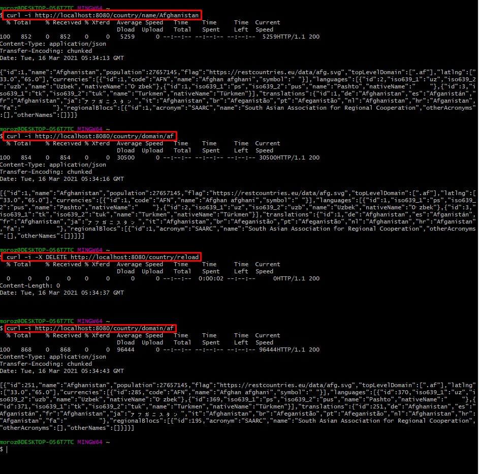

# country_information

**Rest - сервис, который по фильтру отдает информацию по странам. 
При инициализации приложения данные загружаются из стороннего сервиса (link на json : https://restcountries.eu/rest/v2/all) 
и сохраняются в локальную БД.**

#### Country:
- Получить все страны. ***GET: /country/***
- Получить страну по имени. ***GET: /country/name/{name}***
- Получить страны по домену. ***GET: /country/domain/{domain}***
- Перезагрузить данные в БД. ***DELETE: /country/reload***
- Обновить сообщение. ***PUT: /message/***
- Удалить сообщение. ***DELETE: /message/{id}***

#### Пример работы:

